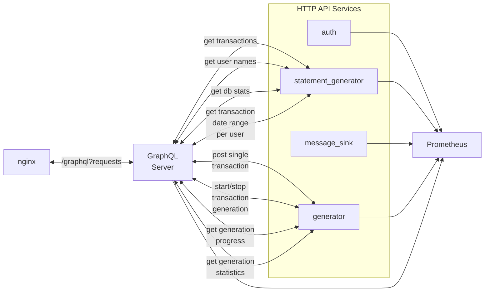

RESTful APIs are used for NodeJS backend with a data validation with Zod. It is a simple approach made available by the fact that the data types are defined in one place and shared across the project (See [Type system description](./TypesAndSchemas)).

GraphQL is used to provide API for frontend. Within the scope of this project it was unnecessary, but the goal was to explore the tool. I did not use all the features like type inference, caching (not much stale content to cache), authorization (having a single password kind of ruined this one). Basically most things described in https://graphql.org/learn/best-practices/ were omitted. Things like observability instrumenting and federation were new for me and I decided to draw the line there for now and just take a basic schema preparation with data pagination and make it work.

## API nodes schema
<figure>

</figure>

