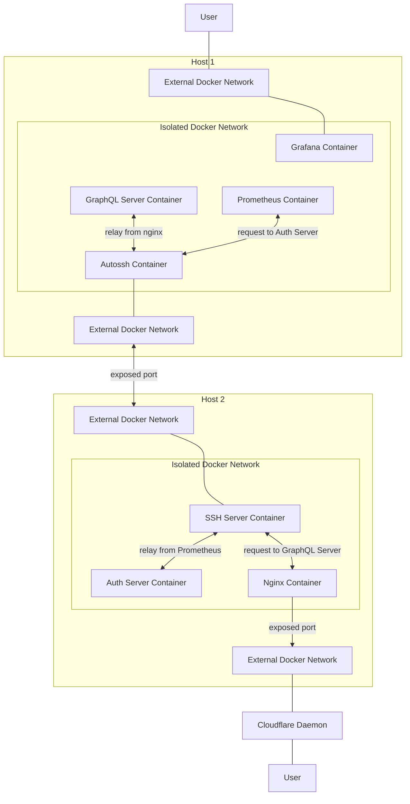

# Split Hosting

This particular schema is used to host bonsite.org

```mermaid
flowchart TD
    subgraph h1[Host 1]
        ext_net1[External Docker Network]
        subgraph iso_net_1[Isolated Docker Network]
            subgraph spacer[ ]
                style spacer fill:none,stroke:none
            end
            autossh[Autossh Container]
            prom[Prometheus Container]
            gql[GraphQL Server Container]
            g[Grafana Container]
        end
        ext_net1 ~~~ iso_net_1
        ext_net1 --- g
        spacer ~~~ autossh
        spacer ~~~ prom
        gql <--> |relay from nginx| autossh
        prom <--> |request to Auth Server| autossh
        ext_net[External Docker Network]
        autossh --- ext_net
    end
    user1[User] --- ext_net1
    subgraph h2[Host 2]
        ext_net3[External Docker Network]
        subgraph iso_net_2[Isolated Docker Network]
            subgraph spacer1[ ]
                style spacer1 fill:none,stroke:none
            end
            ssh_server[SSH Server Container]
            h2auth[Auth Server Container]
            nginx[Nginx Container]
        end
        ext_net3 --- ssh_server
        spacer1 ~~~ ssh_server
        spacer1 ~~~ h2auth
        ssh_server <--> |relay from Prometheus| h2auth 
        ssh_server <--> |request to GraphQL Server| nginx
        nginx --> |exposed port| ext_net4[External Docker Network]
    end
    ext_net3 ~~~ iso_net_2
    ext_net <--> |exposed port| ext_net3
    ext_net4 --- cf_daemon[Cloudflare Daemon]
    cf_daemon --- user2[User]
    click user1 "/docs/services/WebApp" "Web App docs"
    click user2 "/docs/services/WebApp" "Web App docs"
    click nginx "/docs/services/Nginx" "Nginx docs"
    click h2auth "/docs/services/AuthService" "Auth Service docs"
    click gql "/docs/services/GQL" "GraphQL Server docs"
    click prom "/docs/services/Prometheus" "Prometheus Server docs"
    click g "/docs/services/Grafana" "Grafana Server docs"
```