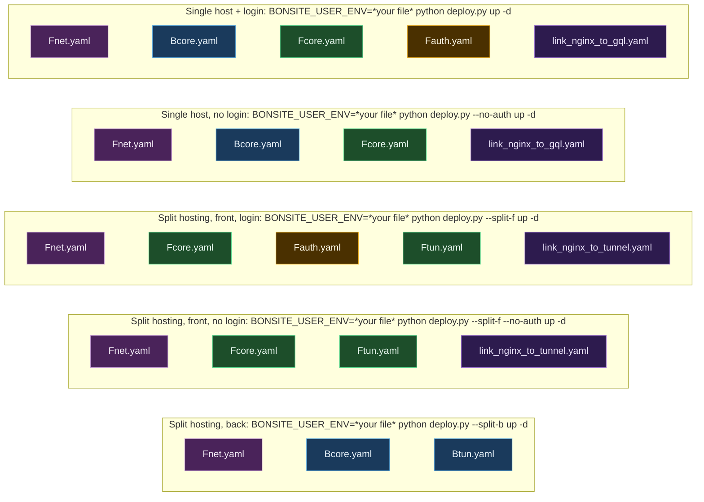
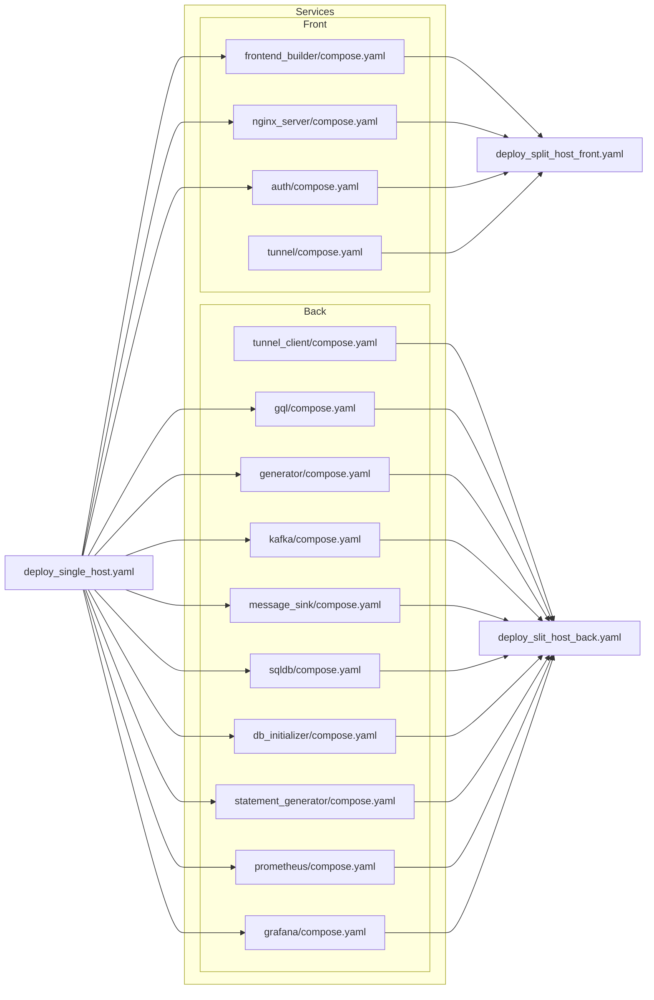
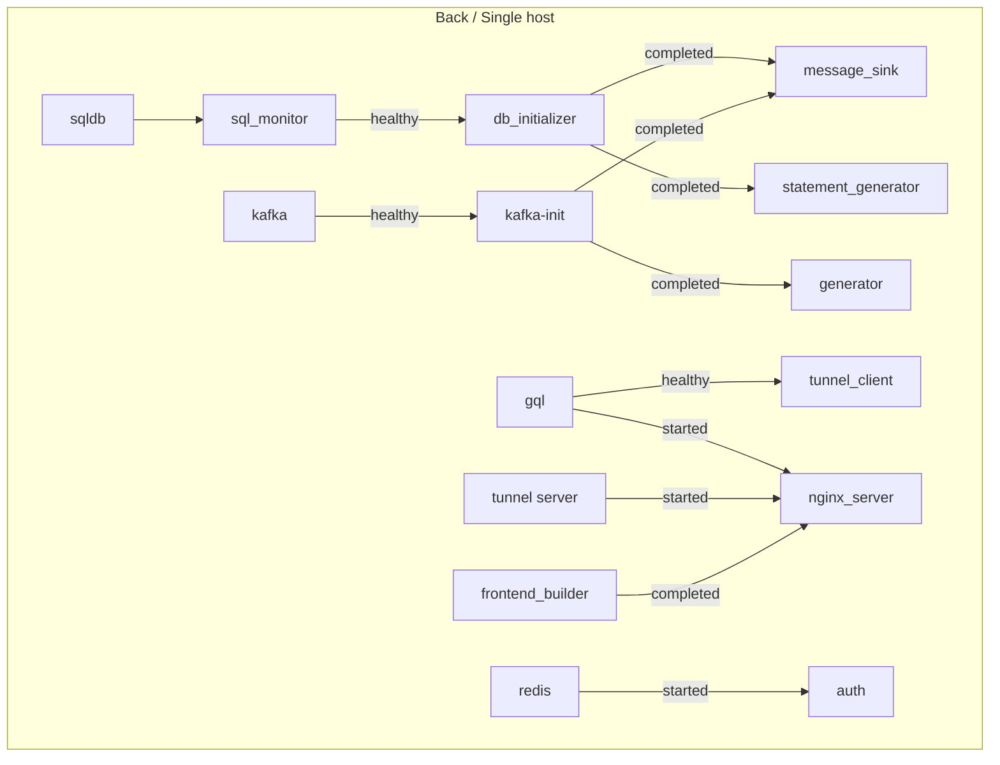
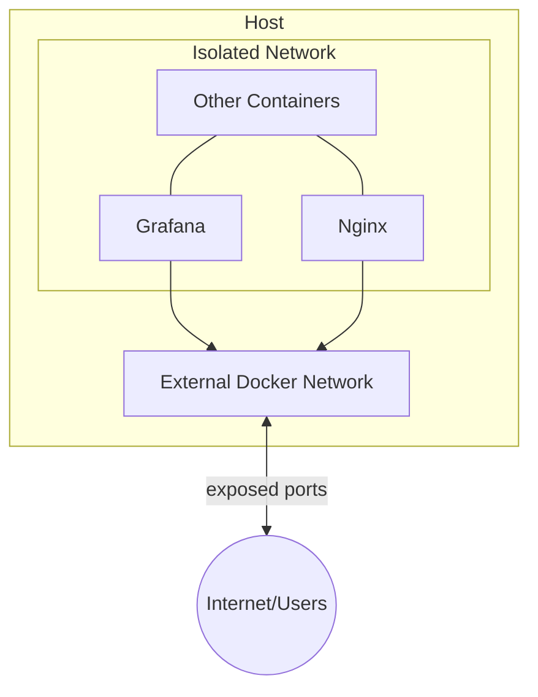

# Deployment

The deployment is done using docker compose. Services described in corresponding compose.yaml files in folders where service specific files are located.

Services are connected with a docker network and locate each other using defined and shared hostnames.


## Compose files and deployment scripts


Tpo deploy a project use the script deploy.py. It makes different modes of deployment using combinations of docker compose files:
| Bundle | Contents |
|--------|----------|
| Fnet   | networks (backend_net, edge_net) and shared volumes |
| Bcore  | backend core: gql, generator, kafka, db stack, monitoring |
| Btun   | backend tunnel client (connects Bcore to a remote frontend) |
| Fcore  | frontend core: builder + nginx |
| Fauth  | frontend auth: auth server + redis |
| Ftun   | frontend tunnel server (SSH reverse-tunnel entry point) |

The modes of deployment are selected as shown below:
<figure>




</figure>

BONSITE_USER_ENV - this variable should define the file holding [variables necessary for the project](#user-variables-with-sample-values).

## Environment variables

The following kinds of variables are used:

1. Most variables are described in a single .env file in the root folder and they are shared across projects.
    1. To avoid collisions variables have prefixes of their service
2. Some variables that are not shared with any other service are placed in the service folder. Like the sqldb/.env
3. Some variables should not have default values, like the variables for passwords or some host system folders. Those are expected to be set by a user in a dedicated [file](#user-variables-with-sample-values). They are marked in (1) as required variables and the user should provide their definitions.

## User variables with sample values:

Nothing will work unless those are provided.

<figure>
```
CLOUDFLARE_SECRET="0xSOME_SECRET_CLOUDFLARE_SECRET"
FRONTEND_DEPLOY_FOLDER_HOST="/FULL PATH TO A FOLDER/.../nginxfiles"
MSSQL_UNIVERSAL_PASSWORD="SOME_SECRET_PASSWORD"
TUNNEL_CLIENT_PRIVATE_KEY_TO_MOUNT="/FULL PATH TO A KEY FOLDER/.../some_key_file"
TUNNEL_CLIENT_PUBLIC_KEY_TO_MOUNT="/FULL PATH TO A KEY FOLDER/.../some_key_file.pub"
LOG_MOUNT_HOST="/FULL PATH TO A LOG FOLDER/.../logfolder"
TUNNEL_CLIENT_SERVER_ADDR="192.168.1.10"
GOOGLE_CLIENT_ID = "SOME_GOOGLE_CLIENT_ID"
GOOGLE_CLIENT_SECRET = "SOME_SECRET_GOOGLE_CLIENT_SECRET"
```
</figure>

GOOGLE_CLIENT_ID and GOOGLE_CLIENT_SECRET are set and chosen at https://console.cloud.google.com/auth/clients

CLOUDFLARE_SECRET is set at cloudflare dashboard and implementation instructions are described at https://developers.cloudflare.com/turnstile/get-started/client-side-rendering/

## Other configurable variables

Those could be defined by user. Or default values will be used.

```
NGINX_HOST_ADDR - addr:port or port - which host addr to expose nginx at.
NGINX_CONF_FILE - Nginx has 2 configuration files. One with the authorization and on without. By default the ./f.conf file is loaded - it contains authorization. The alternative value would be set by the deployment script.
GRAFANA_EXPOSED_PORT_ADDR - addr:port or port - which host addr to expose Grafana at.
```


## How to start this

1. For split hosted bundles
``` 
SPLIT_HOSTED=true docker compose --env-file .env --env-file *file_of_your_choice* -f deploy_split_host_back.yaml up deploy

SPLIT_HOSTED=true docker compose --env-file .env --env-file *file_of_your_choice* -f deploy_split_host_front.yaml up deploy

```

2. For single hosted bundle

```
docker compose --env-file .env --env-file *file_of_your_choice* -f deploy_single_host.yaml up deploy
```

## Compose files structure
<figure>

</figure>


## Service Startup Order (within each deploy file)

<figure>

</figure>


## Network topolory
<div id="net-top" style={{scrollMarginTop: '80px'}}></div>
<figure>

<figcaption>Services are kept within isolated network perimeter unless they need their ports exposed </figcaption>
</figure>


<a id="notes-anchor"></a>
## Notes

1. The deployment and system robustness could be improved with service discovery health monitoring and automatic resource allocation, but it was not in the scope.
2.  Docker swarm could be used to orchestrate deployment during the split hosting layout, which would simplify things and not require a usage of ssh servers, but I was using a rootless docker for deployment just to be sure and in this mode swarm does not work. 
3. Since v3 docker compose the "service_completed_successfully" condition does not differentiate exit error codes so chaining tests got trickier and I let the services running tests linger after completion to make a health.txt file which is checked by health checks. It is hacky but it works for all intended purposes purposes.