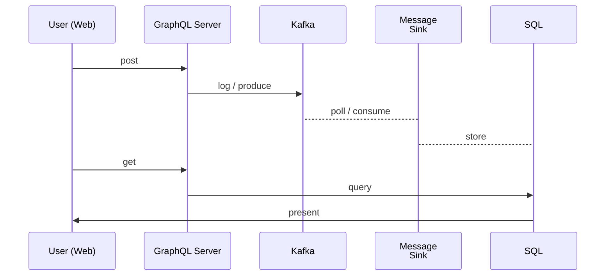

# Overview
This is an application made to explore GraphQL, Kafka and SQL Server.
It consists of services described in  [Services](./services/index.md) and it's goal is to build a functional pipeline where events are posted  to a shared message queue and then stored persistently:

<figure>
    

<figcaption>Figure 1: Store data</figcaption>
</figure>

To make things interactive and leverage GraphQL, it was designed as a web application.

The behavior of UI elements is described in a documentation overlay rendered in the application page. It is a page with input fields which is a simple grid with text elements. To find comments to UI elements in code search for "makeDocumented" in the frontend_builder/app/App.tsx

