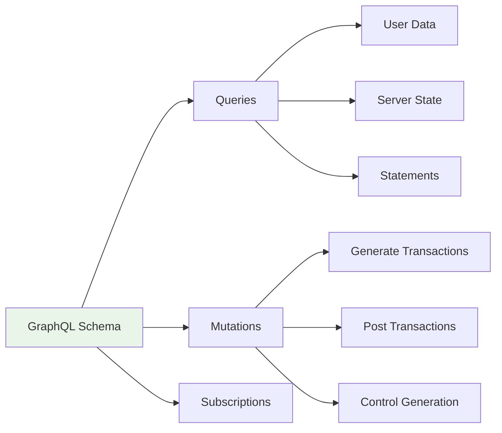

# GraphQL API Gateway

The server provides API for a Web application to create transaction and get back statements and state reports.

The [API](../architecture/APIs) section shows, among other things, the place of Graph QL Server in the system and which calls it makes where.

## Schema Organization

- **Transaction Types**: Core transaction and result definitions
- **User Management**: User data queries and pagination
- **Generation Control**: Start/stop generation with parameter validation
- **Statement Requests**: Financial statement generation and retrieval
- **System Monitoring**: Server state and health metrics

## Implementation Details

- **Apollo Server** with custom schema resolvers
- **Service Discovery**: Dynamic routing to backend services via HTTP
- **Error Handling**: Standardized error responses with proper HTTP codes
- **Request Validation**: Zod schema validation for all inputs
- **Monitoring Integration**: Prometheus metrics for API performance

## Query Categories

## Service Integration

- **Generator Service**: Transaction generation control and monitoring
- **Statement Generator**: Financial statement creation and retrieval
- **Database Layer**: User data queries and system state
- **Authentication**: Session validation and user context

## Benefits

- Single API endpoint for all client applications
- Type-safe operations with automatic validation
- Efficient data fetching with GraphQL's query flexibility
- Centralized authentication and error handling
- Service decoupling through schema federation