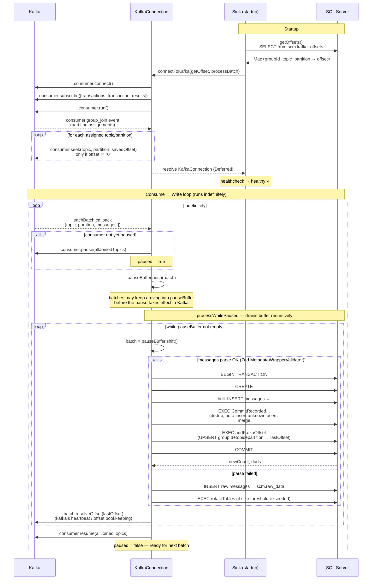

# Message Sink Service

To start consuming Kafka messages, the last consumed offset per topic-partition is read from the database.
Offsets are stored in the database to synchronize writing of data to SQL and saving of Kafka offsets. All is performed as a single atomic transaction, and if it fails, the batch will attempt another write. 
TODO: a potential bug - the batch is removed from the buffer regardless of whether the database write succeeds, so it is possible that if the next batch is written, the previous will be lost. Previous tests didn't show this issue, so will need to make new test to confirm the issue and the fix.

The Kafka consumption is buffered, to have a room for handling database write errors.

"processWhilePaused" - a call that recursively queues itself into the NodeJS event queue with Promise.then.catch.finally upon completion. 

It is not a recursive call.

It gradually empties all the buffered messages that were consumed from Kafka.

As messages are consumed they are forwarded to the database with a "processBatch" callback.
"processConsumedBatch" is provided as "processBatch" when the consumer subscribes to Kafka in "connectToKafka".

The "processConsumedBatch" function writes consumed batches and their Kafka offset to the database. The order of offsets within consumed partition is guaranteed by Kafka.

