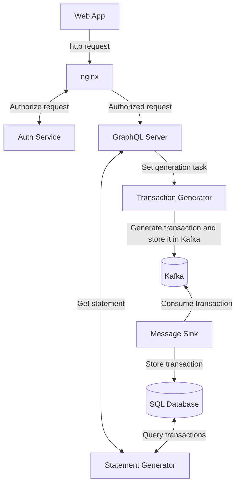
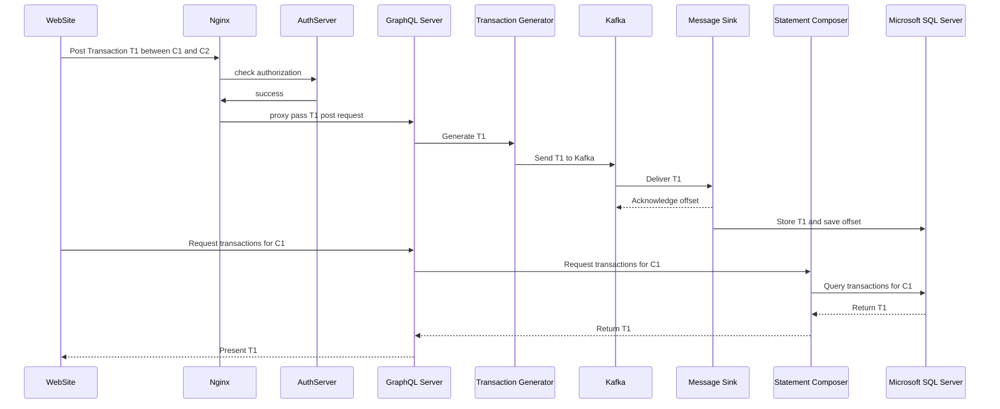

# Services

Below is the overview of how services interact. Feel free to click on the blocks in the diagram.
## System Overview

The following diagram is unreadable without any magnification but is still informative, if someone would really want to take a look.

