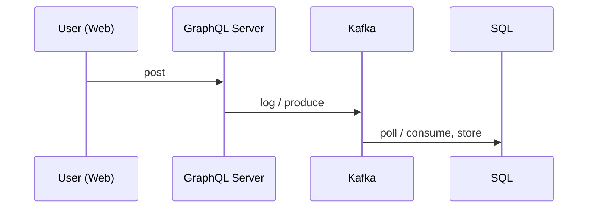
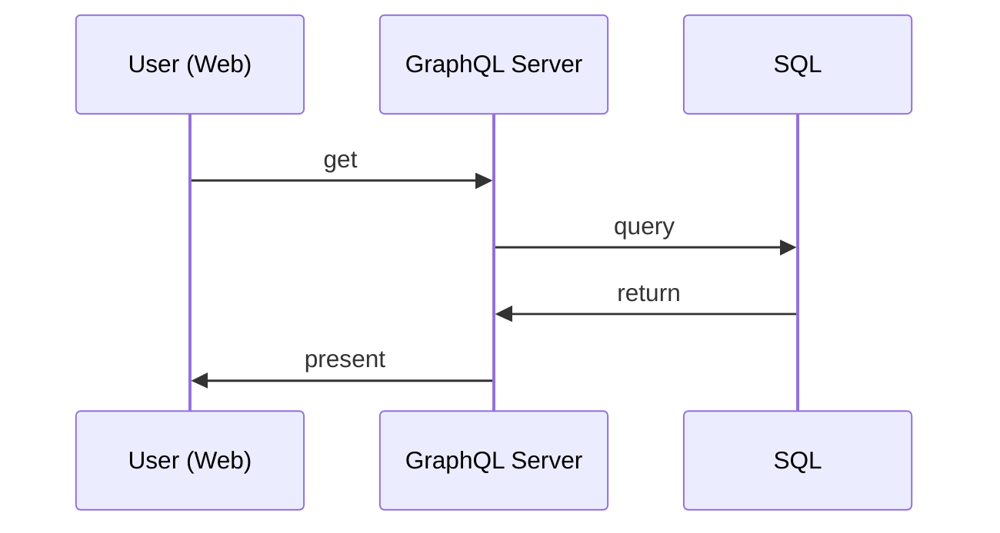

This is an application made to explore GraphQL, Kafka and SQL Server.
It consists of services described in  [Services](./services/index.md) and it's goal is to build a functional pipeline where events are posted  to a shared message queue and then stored persistently:

<figure>

<figcaption>Figure 1: Store data</figcaption>
</figure>

Stored data can later be accessed on request:

<figure>

<figcaption>Figure 2: Get data</figcaption>
</figure>

To make things interactive and leverage GraphQL, it was designed as a web application.

