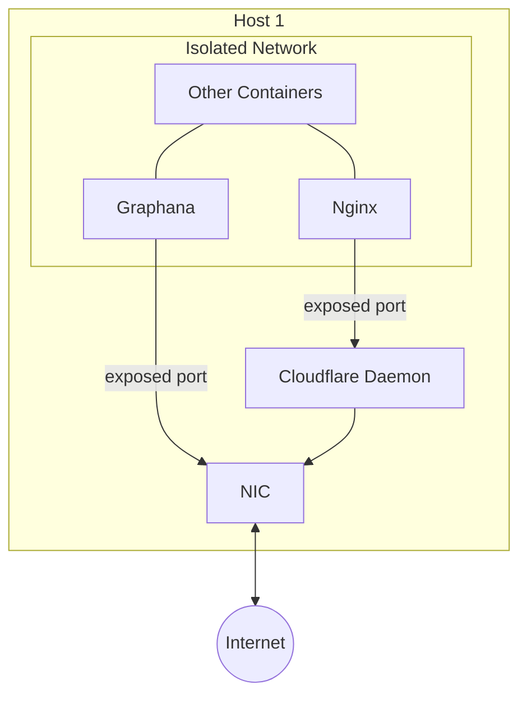

# Single Machine Hosting

This is a Markdown page

some information

```mermaid
flowchart TD
    subgraph h1[Host 1]
        subgraph iso_net_1[Isolated Network]
            g[Graphana]
            nginx[Nginx]
            others[Other Containers]
        end
        others --- nginx
        others --- g
        g --> |exposed port| nic[NIC]
        nginx --> |exposed port| cf_daemon[Cloudflare Daemon]
    end
    cf_daemon --> nic
    nic <--> inet((Internet))
```