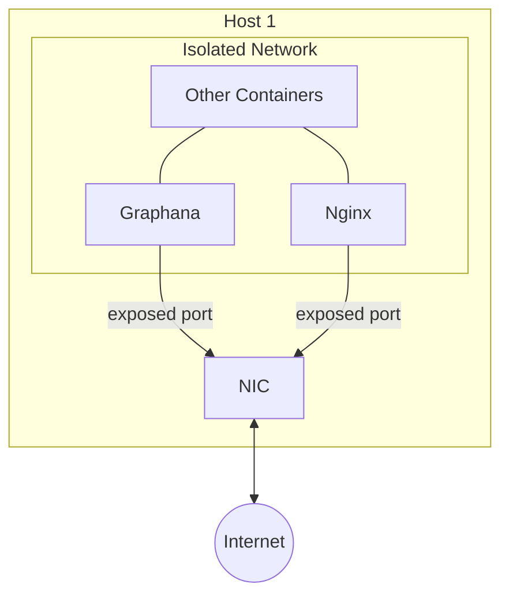

# Deployment

This is a Markdown page

docker services

base service - 
1. [base service] mount work dir
2. [base service] mount common files into workdir
3. [base service] common env vars
4. [base service] align to isolated network
5. [base service] set default healthcheck - poll a local healthcheck http server
6. [base service] set defailt entrypoint - link every file from /src to workdir
7. [Derived services] mount serivce's source folder to /src
8. [Derived services] mount additional required common files to work dir
9. [Derived services] extra env vars
10. [Derived services] override healthcheck if required
11. [Deployment service] add dependencies on other deployment services
12. [Test service] set env var that use used to select how to run the service.

derived services:

Initialisation sequence could be improved with the health checks. SInce v3 docker compose the "service_completed_successfully no longer accounts for the exit code of monitored service so there is no way that I could find to work around of that in a clean way.
One way I used for testing is to make a lingering service with a healthcheck, but you would need to clean up lingering services manually or make a script for this.
Or you can just run in a non detached state and add a teardown at the end of your script.
