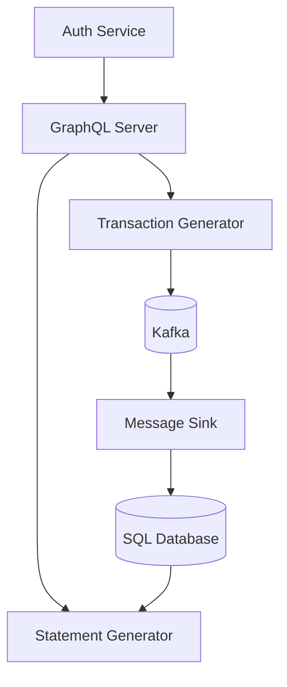
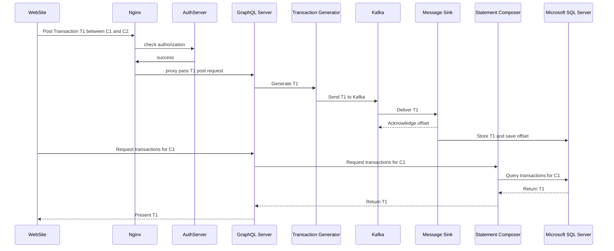

# Services

## System Overview

```mermaid
flowchart TD
    gql[GraphQL Server] --> tg[Transaction Generator]
    gql --> sgt[Statement Generator]
    tg --> kafka[(Kafka)]
    kafka --> ms[Message Sink]
    ms --> db[(SQL Database)]
    db --> sgt
    auth[Auth Service] --> gql
```

```mermaid
sequenceDiagram
    participant W as WebSite
    participant N as Nginx
    participant A as AuthServer
    participant Gql as GraphQL Server
    participant TG as Transaction Generator
    participant K as Kafka
    participant sink as Message Sink
    participant SC as Statement Composer
    participant sql as Microsoft SQL Server

    W->>N: Post Transaction T1 between C1 and C2
    N ->> A: check authorization
    A ->> N: success
    N ->> Gql: proxy pass T1 post request
    Gql->>TG: Generate T1
    TG->>K: Send T1 to Kafka
    K->>sink: Deliver T1
    sink-->>K: Acknowledge offset
    sink->>sql: Store T1 and save offset
    W->>Gql: Request transactions for C1
    Gql->>SC: Request transactions for C1
    SC->>sql: Query transactions for C1
    sql-->>SC: Return T1
    SC-->>Gql: Return T1
    Gql-->>W: Present T1
```

